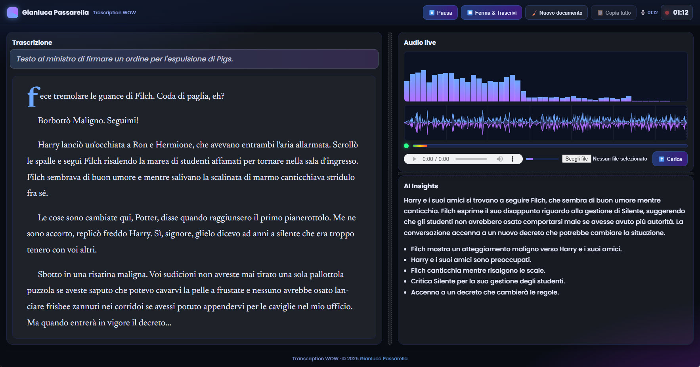

# 🎙️ Transcription WOW

## 🖼️ Screenshot




**Transcription WOW** is a **FastAPI-based web app** that allows you to:
- Record audio directly from the browser or upload audio files.
- Transcribe audio using **OpenAI 


**Transcription WOW** is a **FastAPI-based web app** that allows you to:
- Record audio directly from the browser or upload audio files.
- Transcribe audio using **OpenAI APIs** (configurable models).
- Get a **low-latency live draft preview** while speaking.
- Clean the text from watermarks and reformat it into readable sentences/paragraphs.
- Generate **summaries and bullet-point notes** (“AI Insights”).
- Automatically save audio files and formatted transcripts (HTML) on your Desktop.

## 🚀 Features
- **Browser microphone recording** and file upload (`.wav`, `.mp3`, `.ogg`, `.webm`).
- **Real-time transcription** with multiple model options (`gpt-4o-transcribe`, `whisper-1`, etc.).
- **Live draft (~5s)** for instant feedback while speaking.
- **Summary + bullet notes** powered by OpenAI text models.
- **Automatic incremental saves** and final session file stored under  
  `Desktop/Transcription WOW`.
- **Export to styled HTML** ready for reading or printing.

## 🎥 Demo

[](https://youtu.be/9K_e50-Jmxc)


## 📦 Requirements
Quick install (Python 3.9+):

```bash
pip install fastapi uvicorn httpx python-dotenv python-multipart jinja2 openai 
```

## ⚙️ Configuration
Create a `.env` file in the project root with the following variables:

```ini
OPENAI_API_KEY=sk-...                # your OpenAI API key
OPENAI_TRANSCRIBE_MODEL=gpt-4o-transcribe   # or whisper-1, gpt-4o-mini-transcribe
OPENAI_TEXT_MODEL=gpt-4o-mini
LOGO_NAME=YourName
RELOAD=false
LIVE_DRAFT_ENABLED=true
LANGUAGE=en                          # optional, 2-letter code (it, en, fr...)
TEMPERATURE=0
PORT=8000
```

## ▶️ Run
Start the server with:

```bash
python transcription_wow.py
```

or:

```bash
uvicorn transcription_wow:app --reload
```

Open [http://127.0.0.1:8000](http://127.0.0.1:8000) in your browser.  
> ⚠️ Browser microphone requires **HTTPS** or `localhost`.

## 📂 Project structure
```
├── transcription_wow.py              # FastAPI backend (API + file saving logic)
├── templates/
│   └── index.html      # Web UI (recording, live audio, AI Insights)
├── .env                # Environment variables (create this file)
└── Desktop/Transcription WOW/   # Auto-generated folder with audio and transcripts
```

## 🖼️ Interface
- **Main column** → transcribed text (with autoscroll).
- **Sidebar** → live spectrum, RMS history, audio player, and AI Insights panel.
- **Top toolbar** → controls to record, stop, upload, start a new document, copy text.

## 🔒 Security notes
- The server sets CSP, Referrer-Policy, and Permissions-Policy headers to protect microphone usage.
- Files are saved **locally only** in the user’s Desktop folder.

## 📜 License
MIT — feel free to use, modify and improve.
